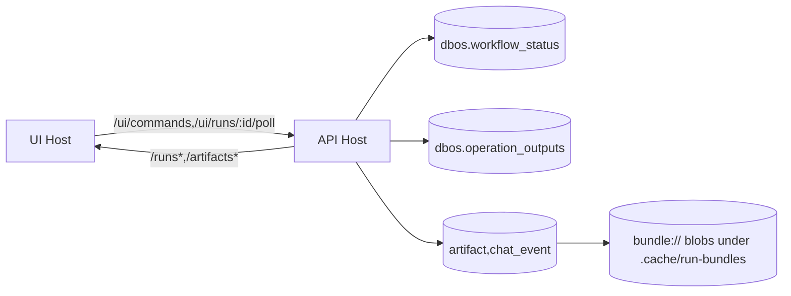

# ADR-003: Sprint2 Truth-Plane Closure (Artifact-First, Fail-Closed, Additive)

- Status: Accepted
- Date: 2026-02-23
- Scope: `spec-0/00-learnings.jsonl`, `spec-0/03-htn.jsonl`, `spec-0/03/*.jsonl`, `spec-0/03-tasks.jsonl`, `spec-0/03-tutorial.jsonl`
- Supersedes: none
- Depends-on: ADR-001, ADR-002

## Context (compressed)
Sprint2 had one core risk: *spec wanted new UX/API surfaces while runtime contracts were already frozen*. Failure modes were known: route churn, selector churn, truth leakage, export synthesis drift, replay flakes, startup noise, UI/API boundary confusion.

Hard constraints already codified:
1. Runtime truth = DBOS projections (`dbos.workflow_status`,`dbos.operation_outputs`), not app shadow state.
2. Artifact truth = persisted immutable rows; export/bundle/detail/download must be persisted-first, blob-verified.
3. Chat truth = control-plane ledger only (`cmd,args,run_id`), never answer text.
4. API migration is additive: canonical `/runs* + /artifacts* + /healthz`; `/runs*` removal forbidden before **2026-06-30**.
5. Run start migration is additive/time-boxed: canonical `{intent,args}`; compat `{source}` only until target sunset **2026-06-30**.
6. UI contract is API-like: frozen plane IDs + strict status FSM + HX full/fragment/history parity + OOB atomic poll updates.
7. Release verdict is single-path: `mise run ci`.
8. Living-spec loop mandatory for behavior deltas.

## Decision
Adopt a **5-layer contract stack**; each layer fail-closed, additive-only by default:
1. `Truth layer`: DBOS projection + persisted artifact rows + strict provenance schema.
2. `Command layer`: parse/validate/normalize (`{intent,args}` first, `{source}` compat explicit), strict typed 4xx.
3. `Transport layer`: `/runs*` + `/artifacts*` + `/healthz`, raw-path hostile ID guards, binary-safe proxy/download.
4. `UI layer`: server-rendered HTMX protocol (`full|fragment|history-restore`) + strict `#run-status` FSM + OOB atomicity.
5. `Proof layer`: deterministic tests/replay/idempotency/e2e/golden/perf/ops signoff via `.mise.toml` -> `mise run ci`.

## Why this, not alternatives
- Not “big-bang replace”: would break sprint1 clients/selectors/proofs.
- Not “keep source fallback forever”: violates determinism + dedup integrity + sunset policy.
- Not “export-time artifact synthesis”: creates non-durable truth drift.
- Not “SPA truth cache”: conflicts with DBOS/projection truth + HX contracts.

## Canonical Pipeline (must-hold)
```txt
request
 -> parse(raw path/body)
 -> validate(typed boundaries)
 -> normalize(canonical envelope)
 -> pure transform/projection
 -> effect adapter (idempotent key)
 -> persist/projection read
 -> canonical response (typed 4xx | opaque 5xx)
```

## Architecture Snapshot


## Invariants (non-negotiable)
1. Artifact table append-only; UPDATE/DELETE forbidden by DB trigger.
2. Workflow success requires persisted artifacts (`FAILED_NO_ARTIFACT` on zero).
3. Persisted-blob consumers must read `uri` + verify `sha256`; unreadable/mismatch => opaque 5xx.
4. JSON artifact detail decode strict; parse failure => opaque 5xx.
5. `workflowId` dedup strict by normalized payload hash; mismatch => `409 workflow_id_payload_mismatch`.
6. `POST /runs` accepts canonical `{intent,args}` + slash `cmd`; malformed => typed `4xx` (`invalid_json`,`invalid_command`,`invalid_run_payload`,...).
7. `/runs/:id` frozen keys stay stable; new fields additive only (`artifacts[]`, trust fields).
8. Artifact vocabulary fixed: `raw,docir,chunk-index,memo`.
9. Chat rows cannot carry answer text; `assistantAnswer` in prod code is lint-blocked.
10. UI IDs/fsm/poll contract fixed: `#conversation-plane,#execution-plane,#artifact-plane` (+ aliases `#conv,#exec,#artifacts`), status `idle|running|done|error`, poll OOB exactly `#exec,#artifacts,#run-status`.

## Compatibility Windows (dated)
- `/runs*` compat mandatory through at least **2026-06-30**.
- `{source}` start-body compat target sunset **2026-06-30**; removal requires explicit compat-hit evidence + same-change policy/learnings/rules updates.

## Walkthroughs (minimal but decisive)
### A. Happy path (`cmd`)
```http
POST /runs {"cmd":"/doc alpha beta","sleepMs":50}
=> 202 {run_id,status:"running",...}
GET /runs/:id
=> {run_id,status,dbos_status,header,timeline,artifacts:[...]}  // frozen+additive
GET /artifacts/:id/download
=> raw bytes + passthrough content headers
GET /runs/:id/bundle(.zip)
=> deterministic identical bytes
```

### B. Fail-closed hostile path
```bash
curl --path-as-is /runs/%2E%2E           # 400 invalid_run_id
curl --path-as-is /artifacts/%2E%2E      # 400 invalid_artifact_id
curl -X POST /runs -d '{"cmd":"/bogus"}' # 400 invalid_command
```

### C. Persisted-first export bridge proof
1. Run completes; artifact rows persisted.
2. Tamper `prepare` timeline output to remove source.
3. `GET /runs/:id/export` still `200` (reads persisted rows), not legacy `422 source_unrecoverable`.

### D. Resume control proof
- Non-resumable status => `409 run_not_resumable`.
- `CANCELLED|RETRIES_EXCEEDED` => explicit resume allowed; completed steps not duplicated.

### E. UI protocol proof
- UI host non-HX `/runs/:id` => full shell.
- HX request => fragment.
- HX history-restore => full shell.
- `/ui/runs/:id/poll` one response updates `#exec,#artifacts,#run-status` atomically.

## Consequences
- Pros: deterministic truth, migration safety, operator predictability, byte-stable artifacts/bundles, replay-safe recovery, CI parity.
- Costs: stricter input contracts, more explicit compat bookkeeping, no convenience fallbacks, higher proof burden per behavior delta.
- Rejected debt: silent synthesis, mutable artifacts, selector renames, shadow command graphs, UI truth inference.

## Enforcement Matrix
- Policy: `AGENTS.md`, `.codex/rules/*`, `spec-0/00-learnings.jsonl`.
- Execution ledger: `spec-0/03-tasks.jsonl` (C0..C8 closure incl post-signoff hardening).
- Operator doctrine: `spec-0/03-tutorial.jsonl` + showcase signoff.
- Gate: `.mise.toml` + GH Action `mise run ci` only.

## Future Change Rule
Any behavior delta touching API/UI/runtime truth must ship in one change set with:
1. proof (test/golden/perf/signoff as applicable),
2. durable decision/constraint append (`spec-0/00-learnings.jsonl`),
3. execution append (`spec-0/03-tasks.jsonl`),
4. operator/tutorial update when UX/ops shifts,
5. rule update if a new failure mode appears.

## Companion
See `docs/adr/003-sprint2-truth-plane-closure/` for compact maps/checklists.
