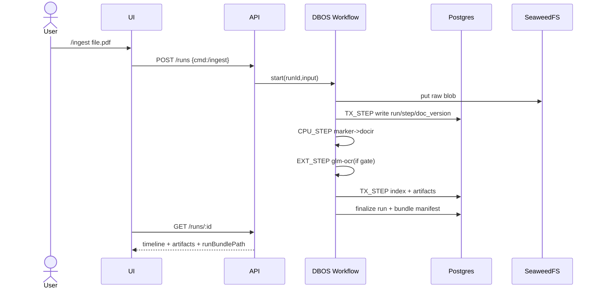

# RFC-000: Durable Agent OS (Artifact-First, DBOS-Only)

Status: Proposed
Owners: Platform
Audience: Staff+ Eng
Scope: Runtime + data + UX contract (not implementation detail bikeshedding)

## 0. One-line thesis
If an action is not `(workflow, logged steps, emitted artifact)`, it is non-existent.

## 1. Why this RFC exists
Current agent products optimize demo-latency, not correctness, replayability, or audit durability. We optimize opposite axis: deterministic, resumable, artifact-centric org memory compounding.

## 2. Hard decisions (closed)
1. Orchestrator: DBOS TS only. No external loop scheduler/executor.
2. Control-flow locus: workflows only; side effects only in logged/idempotent steps.
3. State substrate: Postgres only (DBOS system+app+search+audit).
4. Blob substrate: SeaweedFS only (S3 gateway interface, but our API semantics).
5. Parse fast path: Marker.
6. OCR fallback path: GLM-OCR gated by deterministic confidence policy.
7. Skill substrate: Agent Skills `SKILL.md` + pi-mono discovery/package model.
8. UX frame: 3 planes only: Conversation(command router), Artifacts(truth), Execution(timeline trust).
9. Background work: DBOS queues/scheduled only.
10. CI parity: one gate (`mise run ci`) defines release truth.

## 3. Non-negotiable invariants
1. Crash mid-run resumes from last completed step.
2. External effects are exactly-once-effective via idempotent effect wrapper; raw external calls forbidden.
3. Workflow tests with behavior freeze `Date.now` + `Math.random`.
4. Golden/run-bundle diffs path/time neutral.
5. Sandbox execution is explicit, read-only input mount, explicit export, env allowlist, deterministic payload hash.
6. UI assertions use state IDs/transitions, not pixel snapshots.
7. Perf budget misses = correctness failures.
8. New quality gates must be wired into `mise run ci`.

## 4. Product contract (what users actually get)
### 4.1 Run contract
`POST /runs` => starts workflow => returns `runId`.
`GET /runs/:id` => timeline + artifacts + runBundlePath.

No run without timeline. No successful run without >=1 artifact.

### 4.2 Plane contract
1. Conversation plane: accepts commands (`/ingest`,`/ask`,`/research`,`/promote`), creates runs, never stores truth payloads.
2. Artifact plane: immutable outputs + provenance links.
3. Execution plane: ordered step ledger (status, retries, I/O hashes, permissions, costs).

## 5. Workflow grammar (enforced)
- `TX_STEP`: transactional Postgres write+step log coupling.
- `EXT_STEP`: external call, mandatory idempotency key + intent record + retry semantics.
- `CPU_STEP`: pure transform.
- `SANDBOX_STEP`: isolated execution, deterministic exported payload.

Rule set:
1. Workflow code controls sequencing/branching only.
2. I/O belongs in steps.
3. Irreversible side effects as terminal or compensated saga edges.
4. Every step emits canonical event shape.

```ts
// pseudo-contract
await step("callIdempotentEffect", {
  effectKey: sha256(runId + stepName + stableInput),
  op: "send_email",
  payload,
});
```

## 6. Data model (minimum viable permanent)
```sql
-- run ledger
run(id pk, workflow, status, started_at, ended_at, input_hash, output_hash);
step_event(id pk, run_id fk, seq, step_name, step_type, status, in_hash, out_hash, retry, started_at, ended_at, meta_json);
permission_gate(id pk, run_id fk, gate_type, status, decided_by, decided_at, reason);
artifact(id pk, run_id fk, type, uri, sha256, provenance_json, created_at);

-- org-memory/doc IR
doc(id pk, namespace, source, title, sha_raw, acl_json, created_at, updated_at);
doc_version(id pk, doc_id fk, version, sha_parsed, diff_base, ingest_run_id fk, created_at);
doc_ir_block(id pk, doc_version_id fk, block_type, page, bbox_json, text, json_payload, block_hash, citations_json);
entity(id pk, namespace, type, canonical, attrs_json);
entity_mention(id pk, entity_id fk, doc_version_id fk, block_id fk, span_json);
timeline_event(id pk, namespace, ts, label, confidence, source_block_id fk);
retrieval_lex(block_id pk fk, tsv tsvector);
retrieval_vec(block_id pk fk, emb vector);
table_index(id pk, block_id fk, table_id, row_n, col_n, cell_text, cell_json);
```

## 7. Ingestion/retrieval/postprocess walkthroughs
### 7.1 Ingest (`/ingest`)
1. Upload raw => SeaweedFS immutable blob (`sha256` path).
2. Marker parse => structured markdown/json + extracted assets.
3. Confidence gate per page/region.
4. Gate true => GLM-OCR merge patch into DocIR.
5. Normalize DocIR blocks, hash, persist.
6. Index: lexical + vector(optional lane) + table-addressable lane.
7. Emit artifact pack (`exec_memo`,`key_decisions`,`actions`,`risks`,`glossary`,`timeline_events`,`who_cares`).

### 7.2 Ask (`/ask`)
1. Query parse => retrieval fusion (`FTS + vector + table exact`).
2. Compose answer as artifact memo with citations to `doc_ir_block` IDs.
3. Reject “chat-only answer”.

### 7.3 Promote (`/promote`)
1. User->team->org promotion is explicit workflow.
2. Writes provenance-preserving copy/ref + ACL overlay update.
3. Emits promotion artifact + timeline audit trail.

## 8. Sequence diagrams
### 8.1 Run lifecycle


### 8.2 Failure + resume
```text
t0 step#4 running -> process crash
restart -> DBOS reads step log -> step#1..#3 replay from persisted outputs -> resumes step#4
result: no duplicated external effect if effectKey stable
```

## 9. Acceptance matrix (ship/no-ship)
Ship only if all true:
1. `kill -9` mid-run then restart resumes correctly.
2. Golden diff is structural-only and approved.
3. Run bundle exports reproducible manifest + artifact references.
4. Sandbox chaos test input-identical => output hash-identical.
5. UI e2e passes state-transition assertions.
6. Perf budgets pass.
7. `mise run ci` green (no alternative path accepted).

## 10. Anti-goals
1. Free-form chat memory as source-of-truth.
2. Orchestrators beside DBOS.
3. Extra infra (separate vector DB, ad-hoc cron fleet).
4. Pixel-snapshot based correctness.
5. “We can’t explain this output” runs.

## 11. Migration/phase plan (1-5d mini-epics)
1. Sprint 1: durable kernel (run model + resume + execution plane v0).
2. Sprint 2: artifact-first UX + command router + artifact viewer.
3. Sprint 3: SeaweedFS + Marker + FTS vertical slice.
4. Sprint 4: GLM-OCR deterministic fallback + reingest diff.
5. Sprint 5: retrieval fusion + table lane + `/ask` artifactization.
6. Sprint 6: org-memory derivative pack + entity/timeline extraction + promote.
7. Sprint 7: skills loader + pi-mono packaging + skill->workflow emit.
8. Sprint 8: sandbox/browser operator + connector inbox.

## 12. Risks + forced mitigations
1. OCR runner drift/flakiness -> pin runtime versions; add canary workflow; fallback runner.
2. “S3-compatible” edge mismatches -> enforce storage through our blob API abstraction.
3. Nondeterministic tests -> frozen clocks/random + canonical JSON output.
4. Side-effect duplication -> enforce wrapper lint rule + intent/outbox schema checks.
5. Scope creep in UI -> strict 3-plane DOM ID contract.

## 13. Decision rules (for future RFCs)
1. Prefer boring deterministic primitives over clever dynamic agents.
2. Accept feature only if representable as DBOS workflow + step schema + artifact output.
3. Reject design adding unbounded host dependencies or second command graph.

## 14. Canonical axiom
`No workflow log, no artifact, no truth.`
